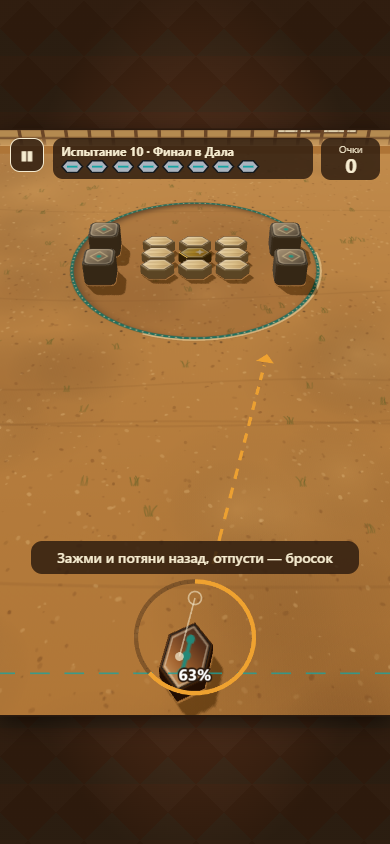

# Эксперимент: 3D-вид «бросаешь с высоты»

Влито в `main`. **3D — вид по умолчанию.** 2D выбирается в «Настройки → Вид: 2D» (выбор запоминается) или параметром `?view=2d`. Без WebGL, при потере контекста или FPS < 40 игра сама переходит в 2D и запоминает это для устройства; если 3D-модуль не загрузился (нет сети), 2D включается только до перезапуска.

## Что сделано

- **Физика и правила не менялись.** Мир Matter остаётся плоским (вид сверху); 3D-сцена каждый кадр читает снимок тел `{x, y, angle, type, z, alpha}` и ничего не пишет обратно. Тест `tests/render-isolation-3d.test.ts`: одна и та же расстановка и тот же бросок дают **побитово одинаковые** финальные позиции с 3D-чтением и без него.
- **Рендер:** Three.js 0.186, подключается **динамическим импортом** только при выборе 3D. Импортируются только нужные классы (`view3d/three-lite.ts`), ленивый чанк — **139 КБ gzip** (лимит 220). Основной бандл вырос на ≈ 3,7 КБ gzip (математика камеры и связка). Бюджет в CI (`scripts/check-size.mjs`) считает основной бандл, облачный чанк и 3D-чанк отдельно.
- **Слои:** под прозрачным Phaser-canvas лежит canvas Three.js того же размера (подгоняется `ResizeObserver` под Phaser `FIT`). Phaser рисует поверх: прицел, кольцо силы, пыль, всплывающие очки — в перспективе через `project()`. HUD и меню (HTML) не менялись.
- **Сцена:** земля с текстурой текущей площадки (та же, что в 2D), вокруг — однотонная земля и туман (без резкого края), вертикальный задник с дальним планом площадки (забор, деревья, юрта), кон — декаль из той же текстуры кольца, что в 2D (граница плоская и не искажается). Асыки, сақа, камни — выдавленные **контуры физических тел** (шестиугольник-«косточка», скруглённый квадрат) с фаской; верхняя грань — текстура из `render/textures.ts` (скины и оформление магазина работают), боковины — средний цвет кромки, темнее на 25 %. Золотой — металлический отлив (`metalness 0.7`, лёгкое свечение), тяжёлый — матовый тёмный. Подпрыгивание `z` — реальный подъём по высоте.
- **Свет и тени:** `HemisphereLight` по палитре площадки + `DirectionalLight` сверху-слева (то же направление, что тени в 2D). «Высокое» — настоящие тени (`PCFSoftShadowMap`, карта 1024); «Низкое» и «Авто» при просадке — мягкие пятна-тени, без антиалиасинга, `pixelRatio ≤ 1.5`.
- **Камера** (`view3d/camera3d.ts`, чистая математика без WebGL): `fitCamera()` перебирает наклон, FOV, точку взгляда и расстояние и выбирает вариант, где выполнены все условия и кон крупнее, а углы ближе к «естественным». Режимы: `idle` (дыхание ±4, 6 с), `aim` (подъезд до 40 единиц и −2° FOV по силе), `follow` (взгляд вслед за сақа с весом 0.35, с ограничением), `settle` (возврат за 600 мс), толчок на комбо (+2° FOV на 120 мс, тряска). При `prefers-reduced-motion` камера статична.
- **Ввод:** та же «рогатка». Точка касания в нижней трети экрана → луч на плоскость земли `Y = 0`; вектор броска считается **в мире** той же `computeAim` с теми же `MIN_PULL/MAX_PULL`. Если луч уходит выше горизонта — остаётся последняя валидная точка. Линия направления и кольцо силы — точки на земле, спроецированные на экран; в 3D линия длиннее, чем в 2D, на «Лёгком» — ещё длиннее.
- **Откаты в 2D:** нет WebGL, контекст потерян и не восстановился за 2 с, средний FPS < 40 три секунды подряд, загрузка дольше 8 с → «Переключено на 2D для плавности», на устройстве запоминается `view3dBlocked` (ручной выбор 3D снимает запрет). `?view=3d` включает 3D на сессию, `?fpsguard=0` отключает откат по FPS (для тестов с программным WebGL).
- **Освобождение ресурсов:** при выключении — `dispose` геометрий, материалов, текстур, рендерера и `forceContextLoss` (браузеры ограничивают число WebGL-контекстов). E2E: 20 переключений 2D↔3D подряд — число геометрий и текстур в `renderer.info` не растёт, ошибок нет.

## Значения камеры и как подобраны

Перебор: наклон 40–72° (шаг 2), FOV 34–56° (шаг 2), точка взгляда `z` 420–700, расстояние 700–2000. Условия:

1. кон (с запасом на асыки у края) целиком виден, по бокам ≥ 8 % ширины;
2. сақа на линии броска видна и не ближе 12 % высоты к нижнему краю;
3. верх кона ниже HUD (≥ 13 % высоты);
4. ширина обычного асыка в центре кона ≥ 26 CSS px при ширине 390.

Выбрано: **наклон 46°, FOV 50°, взгляд в (360, 0, 680), камера в (360, 540, 1201)** — практически совпало с предложенным в ТЗ стартом `(360, 520, 1200)`.

Поле у игры всегда 2:3 (Phaser `FIT`), поэтому на всех экранах кадр одинаковый, меняется только масштаб в CSS-пикселях.

| Экран    | Контейнер 2:3 | Асык в центре кона | На дальнем краю | Порог |
| -------- | ------------- | ------------------ | --------------- | ----- |
| 390×844  | 390×585       | 28,2 px            | 25,3 px         | 26 px |
| 360×800  | 360×540       | 26,0 px            | 23,4 px         | 24 px |
| 1440×900 | 600×900       | 43,4 px            | 38,9 px         | 40 px |

Центр кона проходит порог везде; **дальний край кона — на 3–4 % ниже порога** (перспектива).

## Решение, которое пришлось принять: усиление оттягивания

У линии броска земля «растянута» перспективой: 1 мировая единица ≈ **2 экранных пикселя**. Если считать силу строго по длине оттягивания в мире, для 100 % пришлось бы тянуть палец вдвое дальше, чем в 2D, и у нижнего края экрана не хватает места. Поэтому оттягивание в мире умножается на экранный масштаб у сақа (`gain ≈ 2,0`): **тот же жест в пикселях даёт ту же силу, что в 2D**, а направление по-прежнему определяется точкой на земле (от `gain` не зависит). Тест `tests/view3d.test.ts` проверяет, что жест даёт тот же вектор, что оттягивание в мире (допуск 3 %).

Ввод пересчитывается по **базовой, неподвижной** камере: «дыхание» и подъезд камеры при прицеливании не сдвигают точку под пальцем, сила не «плывёт».

## Измерения

| Что                                                      | Значение      | Лимит ТЗ          |
| -------------------------------------------------------- | ------------- | ----------------- |
| Ленивый чанк Three.js                                    | 139 КБ gzip   | ≤ 220             |
| Прирост основного бандла                                 | ≈ 3,7 КБ gzip | —                 |
| Вызовов отрисовки, уровень 9 (10 тел), «Высокое»         | 44            | ≤ 60              |
| Вызовов отрисовки, уровень 10 (13 тел + сақа), «Высокое» | 60            | ≤ 60 (на границе) |
| Вызовов отрисовки, «Низкое»                              | 22            | ≤ 60              |
| Треугольников                                            | 2 000–3 300   | < 50 000          |

FPS в headless-браузере не показателен (программный WebGL SwiftShader): его нужно мерить на телефоне.

## Отклонения от ТЗ

- **`TopDownView` не выделен.** 2D-рендер остался в `GameScene` без изменений; 3D подключается отдельной веткой кода (`update3D`, `drawAim3D`, `toScreen`). Причина: вынос стабильного 2D-кода в новый класс — главный риск регрессий, а ТЗ требует, чтобы 3D не мог сломать 2D. Интерфейс 3D-вида (`ThreeView`: `syncBodies`, `render`, `project`, `setCameraMode`, `resize`, `destroy`) совпадает с `WorldView` из ТЗ; `screenToWorld` — чистая функция `screenToGround` в `camera3d.ts`.
- **Форма тел — контуры физики** (шестиугольник 44×26, сақа 56×34, камень 40×40), а не скруглённый прямоугольник и не 72×64: игрок видит ровно то, что сталкивается.
- **Поле настройки** — `save.view` (у сохранения нет вложенного `settings`), плюс `save.view3dBlocked`.
- **Земля за полем** — однотонная с туманом (вариант из ТЗ), без зеркального повтора текстуры.
- **Instancing** не использован: при 60 вызовах в худшем случае не понадобился; это следующий шаг, если на телефоне будет тяжело.

## Известные проблемы

1. **Дальний край кона** мельче порога читаемости на 3–4 % (перспектива).
2. **Много пустой земли между сақа и коном**: при наклоне 46° это цена того, что весь кон и сақа помещаются на портретном экране. Кону досталось ≈ 68 % ширины.
3. **Уровень 10 упирается в лимит 60 вызовов** в «Высоком»: каждое тело — 2 материала (верх и бока) × 2 прохода (цвет и тень).
4. Металл без карты окружения выглядит тускло; золотому добавлено свечение.
5. На HUD и подсказку сверху накладывается верх задника — косметика.

## Рекомендация

**Оставить только по ссылке `?view=3d` (и как «бета» в настройках этой ветки), в `main` пока не вливать.** Все технические условия выполнены: физика изолирована, прицел работает (тест 3 %), откат в 2D надёжен, размер в пределах. Но главный вопрос — удобство и плавность на реальном телефоне — здесь проверить нельзя. Если проверка на телефоне пройдёт (см. ниже), можно влить как «бета» за переключателем в настройках, оставив 2D по умолчанию.

## Проверить на реальном телефоне

- [ ] Плавность: FPS в «Высоком» и «Низком» (`?view=3d&debug=1` показывает FPS); срабатывает ли откат в 2D.
- [ ] Удобство прицеливания: попадает ли бросок туда, куда показывает пунктир на земле; не «слишком ли чувствительна» сила.
- [ ] Читаемость асыков на дальнем краю кона при ярком экране.
- [ ] Нагрев и расход батареи за 5–10 минут игры.
- [ ] Поворот экрана и возврат: canvas’ы совпадают, ничего не съезжает.
- [ ] Сворачивание вкладки и возврат (контекст WebGL не теряется, пауза работает).
