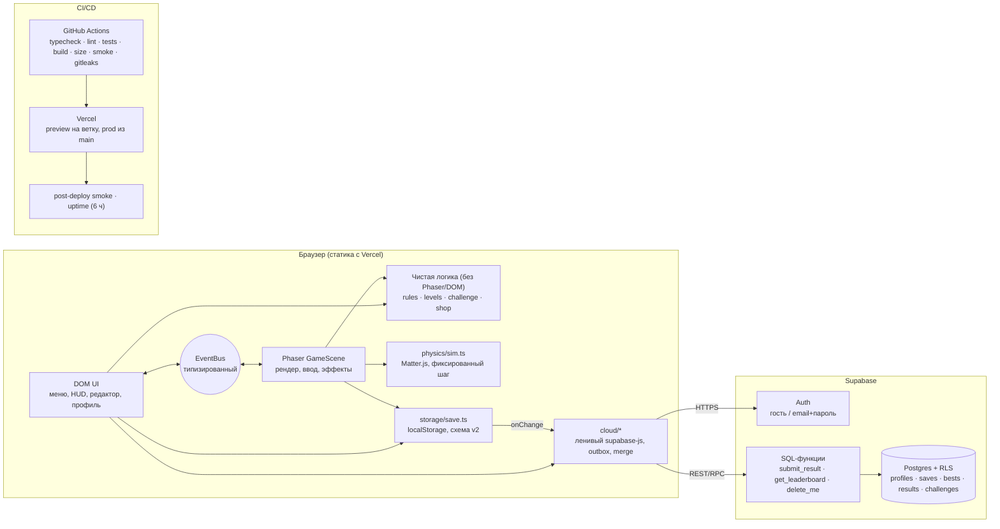

# Архитектура «Асық ату»

## Общая схема

## Слои и правила

| Слой                                          | Где                                                              | Зависит от                        | Правило                                                                               |
| --------------------------------------------- | ---------------------------------------------------------------- | --------------------------------- | ------------------------------------------------------------------------------------- |
| Логика правил, уровней, кодек ссылок, магазин | `src/game/rules`, `src/game/levels`, `src/challenge`, `src/shop` | ничего                            | без Phaser и DOM, покрыто Vitest (≥ 85 % строк)                                       |
| Физика                                        | `src/game/physics/sim.ts`                                        | Matter.js                         | без рендера; та же используется ботом и тестами                                       |
| Рендер и ввод                                 | `src/game/GameScene.ts`, `render/*`, `input/*`                   | Phaser                            | только рисует; визуальные эффекты не влияют на физику                                 |
| UI                                            | `src/ui/*`                                                       | DOM                               | общается с игрой только через `bus.ts`; пользовательские строки — через `textContent` |
| Сохранения                                    | `src/storage/save.ts`                                            | localStorage                      | первичный источник правды; всё в `try/catch`                                          |
| Облако                                        | `src/cloud/*`                                                    | supabase-js (динамический импорт) | надстройка: без сети/ключей игра работает как раньше                                  |

## Поток данных броска

1. `AimController` (Pointer Events) → `GameScene.onRelease` → `Sim.launchSaka`.
2. `Sim.step()` фиксированным шагом 1/60 с; «выбит» — центр вне кона, один раз.
3. После остановки `Round.resolveThrow` считает очки (`scoring.ts`), автомат состояний решает: следующий бросок / победа / поражение.
4. `store.update(...)` пишет рекорды, историю, достижения, `resume` — локально, сразу.
5. `store.onChange` → облачный слой: отпечаток без `resume` изменился → отложенная (3 с) отправка `saves` с проверкой `rev`.
6. Итог раунда → `cloud.submitResult` → очередь `outbox` → RPC `submit_result` (сервер проверяет пределы и частоту) → `bests` → рейтинг.

## Деградация

| Ситуация                                            | Поведение                                                                                                    |
| --------------------------------------------------- | ------------------------------------------------------------------------------------------------------------ |
| Нет переменных `VITE_*` / `VITE_CLOUD_ENABLED≠true` | `FEATURES.cloud = false`: облачные кнопки не показываются, supabase-js не загружается                        |
| Нет сети при старте                                 | `navigator.onLine = false` → запрос не делается; статус «не в сети», при появлении сети — повторная попытка  |
| Облако не ответило за 2 с (спит, недоступно)        | статус `offline`; профиль и рейтинг показывают спокойное сообщение; короткие ссылки заменяются полными `#c=` |
| Сеть пропала во время игры                          | результаты копятся в `outbox` (localStorage), отправляются с паузой 1→60 с                                   |
| Конфликт сохранений между устройствами              | проверка `rev` не прошла → загрузка → `mergeSaves` → повтор                                                  |

## Качество

- CI: `.github/workflows/ci.yml` — любой шаг красный → CI красный.
- Бюджет размера: стартовый JS ≤ 428 КБ gzip, облачный чанк ≤ 70 КБ (`scripts/check-size.mjs`).
- Post-deploy smoke и uptime: `.github/workflows/post-deploy.yml`, `uptime.yml`.
- Сборка знает свой коммит: `__BUILD_SHA__` в «Настройки → О приложении» и в консоли.
