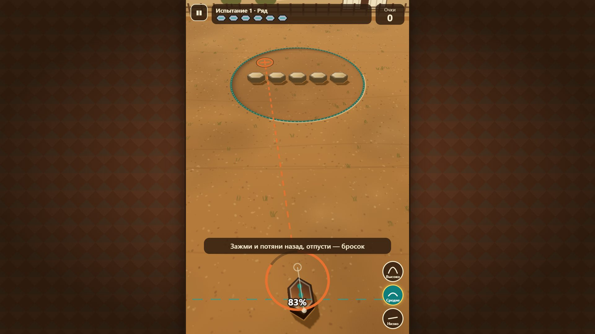
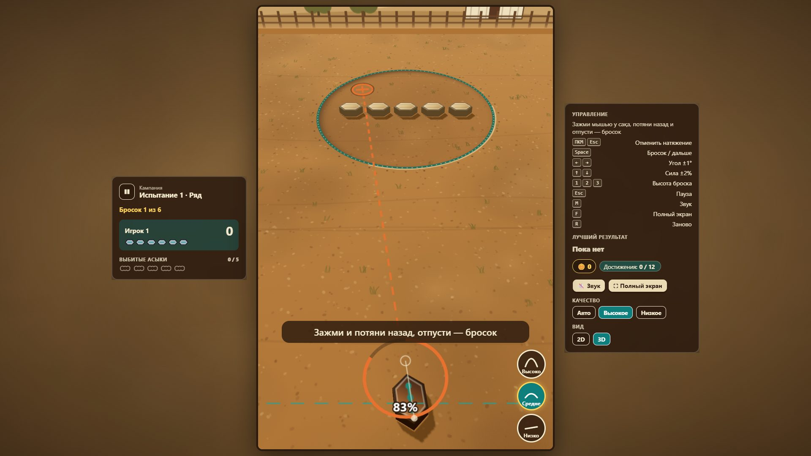
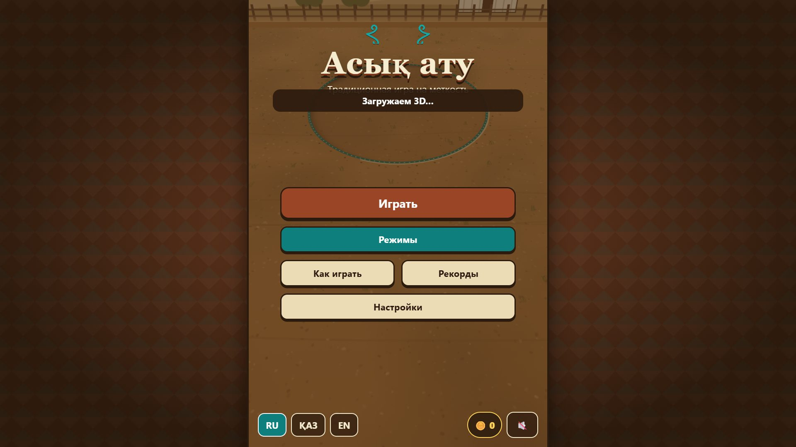
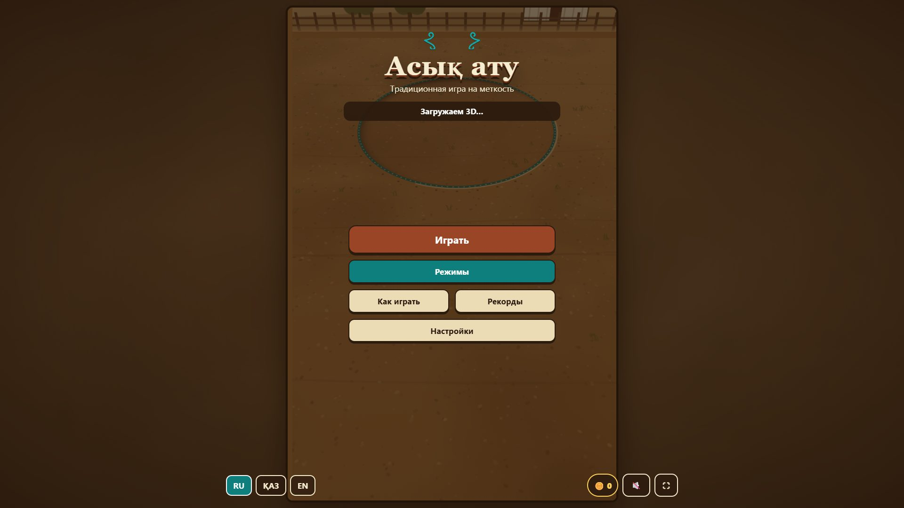

# Десктопная версия

Ветка `feat/desktop-layout`. Физика, правила, хитбоксы и баланс не менялись: поле остаётся логическим 720×1080. Меняется только оболочка вокруг поля: масштаб, раскладка, панели, ввод.

## Режимы раскладки

`src/ui/layout.ts` определяет режим и ставит его в `<html data-layout>`. Режим пересчитывается на `resize`, `orientationchange` (debounce 100 мс) и на изменении медиа-запроса `(min-width: 1024px) and (orientation: landscape)`, без перезагрузки.

| Режим     | Когда                                       | Что на экране                                                                   |
| --------- | ------------------------------------------- | ------------------------------------------------------------------------------- |
| `phone`   | портрет, ширина ≤ 600, телефон «боком»      | как раньше: поле во весь экран, HUD над полем, меню внутри поля                 |
| `compact` | ландшафт 601–1023 (планшет, небольшое окно) | поле по высоте окна + одна колонка панелей справа                               |
| `desktop` | ландшафт от 1024                            | три колонки: панель игры · поле · панель управления; меню — контейнер до 960 px |

Все стили широкого экрана лежат в `src/ui/desktop.css` и ограничены `:root[data-layout='desktop' | 'compact']`. На телефоне `#shell` имеет `display: contents`, панели, подложка и слой меню скрыты, поэтому раскладка телефона прежняя.

## Масштаб и чёткость

- Phaser: `Scale.FIT` + `CENTER_BOTH`. Поле вписано по высоте окна с отступом 16 px сверху и снизу, скролла страницы нет.
- Разрешение холста на телефоне прежнее: `min(devicePixelRatio, 2)`. На широком экране поле обычно больше 1080 px, поэтому берём не меньше высоты экрана в физических пикселях (тоже не больше 2). Иначе на 1440p и 4K картинка растягивалась бы и мылилась.
- Холст Three.js (3D-вид) следит за размером холста Phaser (`ResizeObserver`) и вписан в ту же рамку (проверяет e2e).
- Смена размера окна посреди броска ничего не сбрасывает: указатель захвачен, координаты считаются от текущего размера холста.

## Панели (DOM поверх страницы, не внутри canvas)

`src/ui/side.ts`.

- **Слева:** режим и испытание, номер броска, раунда или волны, игрок (или два игрока в дуэли и «Вдвоём», с подсветкой того, чей ход), очки, оставшиеся броски, выбитые асыки, пауза.
- **Справа:** подсказки управления, лучший результат по текущему режиму и набору правил, тиын, достижения, кнопки «Звук» и «Полный экран», качество, площадка (если куплено больше одной).
- HUD над полем на широком экране скрыт, чтобы данные не дублировались. Кнопки высоты навеса остаются у поля.
- Вокруг поля лежит размытая и затемнённая на 35 % копия текущей карты. Размытие «запечено» в холст 48×72, который браузер растягивает со сглаживанием. CSS-фильтр `blur(24px)` на весь экран вдвое снижал FPS на программной графике (11,5 → 19 кадров в headless Chromium на 1920×1080).
- Меню, уровни, режимы, магазин и настройки на широком экране выводятся в отдельном слое `#overlay`, в контейнере до 960 px. Уровни идут в 4 колонки (на планшете в 3), режимы в 3 (на планшете в 2).

## Мышь и клавиатура

| Ввод                        | Действие                                                                     |
| --------------------------- | ---------------------------------------------------------------------------- |
| мышь у сақа, потянуть назад | натяжение; курсор `grab` / `grabbing`, сақа подсвечен при наведении          |
| правая кнопка / `Esc`       | отменить натяжение (попытка не тратится)                                     |
| `←` `→`                     | угол ±1° (при натяжении мышью — поправка поверх жеста)                       |
| `↑` `↓`                     | сила ±2 %                                                                    |
| `Space`                     | бросок; на экране итога — главная кнопка («Дальше» / «Ещё раз»)              |
| `Esc`                       | пауза / продолжить                                                           |
| `M`                         | звук                                                                         |
| `F`                         | полный экран (кнопка скрыта, если Fullscreen API нет, например в iOS Safari) |
| `R`                         | перезапуск раунда с подтверждением                                           |
| `1` `2` `3`                 | высота навеса                                                                |
| `Tab`                       | фокус по кнопкам; фокус-кольца видимые                                       |

Без мыши: стрелка или `Space` включает прицел (сила 50 %), стрелками он подстраивается, повторный `Space` бросает. Раньше силу набирали удержанием пробела; шаговая подстройка точнее.

Натяжение захватывает указатель (`setPointerCapture`), поэтому бросок не теряется, если мышь вышла за край поля или окна. Горячие клавиши не срабатывают, когда фокус в поле ввода.

## Проверка

- `tests/desktop.test.ts`: режим раскладки по размеру окна, подстройка прицела стрелками.
- `tests/e2e/desktop.spec.ts` (1920×1080): две панели, поле ≥ 85 % высоты, без скролла, панели не наезжают на поле; бросок мышью; отмена натяжения по `Esc` и правой кнопке; пауза по `Esc`; клавиатурный бросок; `M`; `R` с подтверждением; смена размера окна посреди раунда и посреди натяжения; 3D-холст в той же рамке.
- `scripts/shots.ts`: скриншоты меню, середины раунда (рогатка натянута) и итога на 8 экранах, отчёт `report.json` (режим, скролл, обрезка поля, доля высоты поля), для телефона — пиксельная разница с эталоном.

```bash
npm run build && npm run preview                                # в другом терминале
node scripts/shots.ts --out docs/desktop-shots/before           # эталон (до правок)
node scripts/shots.ts --compare docs/desktop-shots/before       # после → docs/desktop-shots/
```

## Результаты (`docs/desktop-shots/report.json`)

| Экран            | Режим   | Поле, % высоты окна | Скролл | Поле обрезано |
| ---------------- | ------- | ------------------- | ------ | ------------- |
| 1920×1080        | desktop | 97,0                | нет    | нет           |
| 1440×900         | desktop | 96,4                | нет    | нет           |
| 1366×768         | desktop | 95,8                | нет    | нет           |
| 2560×1440        | desktop | 97,8                | нет    | нет           |
| 1024×768         | desktop | 86,6                | нет    | нет           |
| 768×1024         | phone   | 100 (по ширине)     | нет    | нет           |
| 390×844, 360×740 | phone   | как раньше          | нет    | нет           |

Телефон 390×844 и 360×740: пиксельная разница с эталоном до правок — **0 %** на меню, середине раунда и итоге.

До / после (1920×1080):

| До                                                     | После                                              |
| ------------------------------------------------------ | -------------------------------------------------- |
|  |  |
|  |  |

Остальные экраны лежат в `docs/desktop-shots/` (после) и `docs/desktop-shots/before/` (до).
