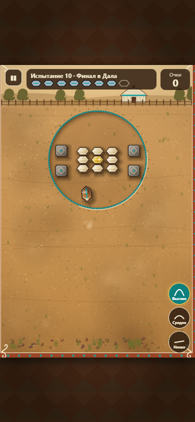

# Навесной бросок: вертикальное измерение «2,5D»

Влито в `main`. **Навес — набор правил по умолчанию**: кнопки «Низко / Средне / Высоко» видны сразу. Классика выбирается в «Настройки → Бросок: Классический» или переключателем на экране уровней (выбор запоминается), а также параметром `?ruleset=classic`. Ссылки-вызовы без поля набора правил по-прежнему открываются в классике.

## Модель

Плоская физика Matter (столкновения, трение, скольжение) осталась основой. Поверх неё — **вертикальный канал**: у тела есть высота нижней грани `z` и вертикальная скорость `vz` (`src/game/physics/vertical.ts`, чистые функции).

Порядок в каждом фиксированном шаге 1/60 с (`Sim.step`):

1. **До Matter:** `vz -= g; z += vz`. Если `z ≤ 0` — приземление: отскок `vz = −vz·E` (или остановка, если удар слабее `VZ_REST`), горизонтальная скорость × `H_KEEP`, событие `landed` (пыль, глухой удар, лёгкая тряска). `frictionAir` тела: в полёте `AIR_DRAG_FLIGHT`, на земле — прежнее.
2. **Перед каждым подшагом Matter:** всем существующим парам контакта выставляется `pair.isSensor = !пересечение_по_высоте`. Resolver Matter пропускает пары-сенсоры, поэтому тела на разной высоте проходят друг над другом. Новые пары получают флаг в `collisionStart`, который в Matter 0.20 приходит **до** разрешения контакта.
   _Почему не `pair.isActive = false`, как предлагало ТЗ:_ `Pair.update` в этой версии каждый шаг возвращает `isActive = true`, поэтому трюк сработал бы только в первом шаге касания. А `isSensor` `Pair.update` не трогает. Вариант с `collisionFilter` отвергнут: он работает на уровне тела, а не пары, и для высоты пришлось бы делить её на слои по 8 px. Покрыто тестами `overlap`.
3. **После шага:** «выбит» (центр вне кона, в том числе в воздухе, один раз), удаление, **перелёт** (сақа в воздухе вышла за поле — бросок потрачен, «Перелёт!», сақа исчезает), остановка (дополнительно все тела на земле).

Пересечение по высоте: `a.z + 2 < b.z + b.H` и `b.z + 2 < a.z + a.H`; толщины: сақа 20, асык 16, блок 34. Стены: для асыков и сақа на земле — всегда, сақа в воздухе их пролетает.

**Подпрыгивание асыков:** при контакте сақа–асык (прошедшем фильтр) с относительной скоростью `s > 6` px/шаг асык получает `vz = min(0,22·s, 7)`, тяжёлый ×0,4. Дальше летит по тем же правилам.

**Запуск** (`src/game/physics/ballistics.ts`): направление и сила — как раньше, плюс высота. `V = V_MAX(высота)·√p`: дальность первого приземления растёт ≈ линейно с силой (50 % силы ≈ половина дальности, тест). `V_MAX` подбирается бинарным поиском по **той же дискретной модели**, что и игра, так чтобы 100 % силы давали приземление на `TARGET_RANGE = 820` px (чуть дальше дальнего края кона). `predictLanding` повторяет модель шаг в шаг: отклонение от Matter — 0 px в 8 из 9 проверенных случаев, в девятом было 27 px из-за потолка скорости (исправлено, см. ниже).

## Константы (`src/game/config.ts`, `LOFT`, `LOFT_ANGLE_DEG`)

| Константа                                   | Значение            | Как подобрано                                                                                                                                                                       |
| ------------------------------------------- | ------------------- | ----------------------------------------------------------------------------------------------------------------------------------------------------------------------------------- |
| Углы низко / средне / высоко                | **8° / 15° / 22°**  | ТЗ предлагало 12/28/48°, но у баллистики вершина = дальность·tgθ/4 **не зависит от гравитации**: при 48° и 820 px вершина была бы ≈ 228 px при требовании 70–110. 22° даёт ≈ 103 px |
| `GRAVITY_Z`                                 | 0,35 px/шаг²        | из требований ко времени полёта: навес 0,7–1,0 с, низкий 0,3–0,5 с                                                                                                                  |
| `AIR_DRAG_FLIGHT`                           | 0,006               | ТЗ                                                                                                                                                                                  |
| `Z0` (рука над землёй)                      | 12                  | ТЗ                                                                                                                                                                                  |
| `TARGET_RANGE`                              | 820 px              | ТЗ                                                                                                                                                                                  |
| `E_GROUND` сақа / асык                      | 0,35 / 0,30         | ТЗ; 1–4 подскока (тест)                                                                                                                                                             |
| `H_KEEP` сақа / асык                        | 0,80 / 0,85         | ТЗ                                                                                                                                                                                  |
| `VZ_REST`                                   | 1,2                 | ТЗ                                                                                                                                                                                  |
| `POP_MIN_SPEED / POP_K / POP_MAX / тяжёлый` | 6 / 0,22 / 7 / ×0,4 | ТЗ                                                                                                                                                                                  |
| `MAX_SPEED` (навес)                         | 36 px/шаг           | классический потолок 30 срезал низкий бросок на 90–100 % силы (стартует с ≈ 33): предсказание расходилось на 27 px. В классике потолок прежний                                      |

Итог: **низкий** — 0,47 с, вершина 40 px (перелетает асыки только в верхней части дуги), после приземления долго скользит; **средний** — 0,65 с, вершина 69 px, 1–2 подскока; **высокий** — 0,78 с, вершина 103 px, перелетает камни (34) и асыки, падает круто.

## Управление

- Три круглые кнопки у большого пальца (справа снизу, выше края поля и под подсказкой): «Высоко / Средне / Низко» с иконками дуг. HTML-кнопки перехватывают касание, поэтому прицельный жест от них не стартует, а начатый жест по ним не «нажимает» (указатель захвачен canvas). Клавиши `1 / 2 / 3`. Выбор запоминается (`save.loft`).
- Прицел — прежняя «рогатка». Вместо пунктира направления — **маркер приземления** (кольцо с крестом) в точке `predictLanding` и линия к нему; на «Лёгком» — ещё кольцо первого подскока. В 3D маркер лежит на земле в перспективе.
- Высота отображается: в 2D спрайт поднимается на `z·0,55` и растёт на `z/350`, тень остаётся на земле, растягивается и светлеет, сақа «кувыркается» (сжатие по поперечной оси); в 3D — реальный подъём по Y и вращение вокруг длинной оси. Высота видна при любом качестве и при `prefers-reduced-motion` (это игровая информация); тряска при reduced-motion отключена.
- Первый раунд в навесе показывает подсказку о кнопках высоты и маркере.

## Наборы правил

- `ruleset: 'classic' | 'loft'`, по умолчанию `classic`. В классике вертикальный канал **не выполняется вовсе** (`Sim` без `{ loft: true }`), потолок скорости прежний. Тест `classic-regression` сравнивает 6 эталонных бросков с записанными **до** изменений (`tests/fixtures/classic-golden.json`) — совпадение побитовое.
- **Рекорды раздельные:** классика — прежние ключи (миграция не нужна), навес — `id:loft`, `дата:loft`, отдельный `endlessBestLoft`. Экран уровней и «Рекорды» показывают выбранный набор с переключателем. Открытие уровней общее.
- **par навеса свой** (`src/game/levels/levels-loft.ts`) = броски «Сильного» бота + 1; классический par не менялся.
- **Ссылки:** в коде испытания занят 1 из 3 запасных бит заголовка — старые коды читаются как классика. Ежедневное и бесконечный получают `&r=loft`. Набор правил из ссылки действует только на этот раунд, настройка игрока не меняется.
- **Облако:** ключ рейтинга с суффиксом `:loft` (`level:3:loft`, `daily:…:loft`, `endless:loft`); в `level_limits` добавлены пределы для `level:N:loft` (генератор + тест согласованности). Схема БД не менялась — отдельное поле `ruleset` в `bests` не понадобилось.
- `resume` хранит набор правил: «Продолжить» возвращает раунд в том же режиме.

## Бот

Тот же `Sim` с `{ loft: true }` и та же баллистика. Кандидаты: 24 направления × 4 силы × 3 высоты = 288; высоты чередуются внутри направления, чтобы отсечка по времени (800 мс, порциями) не выбросила целую высоту. «Лёгкий» бот в 75 % ходов берёт только среднюю высоту и промахивается по силе, как раньше.

## Проходимость (жадный «Сильный» бот, `docs/loft/passability.json`)

| Уровень    | Бросков | par классики | Классика* | Навес, все высоты | Навес, только низко | par навеса |
| ---------- | ------- | ------------ | --------- | ----------------- | ------------------- | ---------- |
| 1          | 6       | 4            | 3         | 3                 | —                   | 4          |
| 2          | 6       | 4            | 4         | 1                 | —                   | 2          |
| 3          | 7       | 5            | 4         | 2                 | —                   | 3          |
| 4          | 7       | 5            | 4         | 3                 | —                   | 4          |
| 5          | 7       | 6            | 5         | 5                 | —                   | 6          |
| 6          | 6       | 4            | 2         | 2                 | —                   | 3          |
| 7          | 7       | 5            | 5         | 5                 | —                   | 6          |
| 8 (камень) | 7       | 5            | 4         | 4                 | 4                   | 5          |
| 9 (камни)  | 8       | 6            | 7         | 4                 | 4                   | 5          |
| 10 (камни) | 8       | 6            | —         | 2                 | 2                   | 3          |
| 11 (Pro)   | 7       | 5            | —         | 4                 | 4                   | 5          |
| 12 (Pro)   | 8       | 6            | —         | 3                 | **не проходится**   | 4          |
| 13 (Pro)   | 8       | 6            | 5         | 5                 | **не проходится**   | 6          |
| 14 (Pro)   | 9       | 7            | 5         | 4                 | 4                   | 5          |
| 15 (Pro)   | 10      | 8            | —         | 4                 | 5                   | 5          |

\* Классика здесь — тот же бот с тем же грубым набором из 96 кандидатов; «—» значит, что этому набору не хватило вариантов. Более плотный перебор (при подборе уровней) проходит все уровни классики.

- **Все 15 уровней проходимы в навесе** за число бросков меньше лимита.
- **Высота нужна:** на Pro-уровнях 12 и 13 без навеса решения нет, на 15-м навес экономит бросок. На уровнях 8–10 низкого броска хватает — там высота даёт свободу, но не новую стратегию. Опциональные уровни «Стена» и «Двор за забором» (ТЗ §6) не делал: хватило времени только на основное.
- **Классика vs навес** (среднее число бросков бота на уровнях, где проходят оба): **4,36 против 3,45**. Навес заметно легче: подскоки и подброшенные асыки разбрасывают кластер. Чтобы звёзды не давались даром, par навеса пересчитан ниже классического.

## Тесты

- `tests/loft.test.ts`: баллистика (дальность при 100 % — до шага, предсказание ↔ Matter ± 2 % для 3 высот × 3 сил, монотонность и линейность, высота и время полёта), вертикаль (затухание подскоков, 1–4 отскока, остановка, нет NaN, **побитовая** повторяемость), пересечение по высоте (над блоком на 50 — нет удара, на 10 — есть; на 20 над асыком — нет, о блок — есть; спуск на асык без «взрыва»), подпрыгивание (предел, тяжёлый ниже золотого), перелёт (ход завершается, асыки у стены остаются в поле), **регрессия классики**, производительность (шаг с 12 телами в воздухе < 1 мс).
- `tests/loft-rules.test.ts`: бит набора правил в коде вызова, старые коды → классика, `r=loft` в ссылках, раздельные рекорды, par, миграция сохранения.
- `render-isolation` (прежние тесты 2D/3D) — зелёные.
- Playwright `tests/e2e/loft.spec.ts`: выбрать «Высоко», бросок, попытки уменьшились, ошибок нет. Все e2e идут в один поток (`workers: 1`): программный WebGL в нескольких браузерах сразу упирается в CPU.

## Известные проблемы

1. Навес заметно проще классики (см. таблицу); баланс — только через par.
2. При 100 % силы дальность «ступенчатая» (приземление фиксируется раз в шаг ≈ 25 px) — маркер это учитывает, потому что считает по той же модели.
3. Низкий бросок после приземления скользит далеко; маркер показывает **приземление**, а не остановку. Новичку это может быть неочевидно.
4. Кнопки высоты занимают правый нижний угол; на узких экранах проверить, не мешают ли большому пальцу.
5. Опциональные уровни только для навеса (§6) не сделаны.

## Рекомендация

**Оставить как «бета» по ссылке `?ruleset=loft` и в настройках, классика по умолчанию, в `main` пока не вливать.** Модель детерминирована, классика не изменилась (эталон), предсказание приземления точное, все уровни проходимы, высота реально нужна на части уровней. Но режим легче классики, а понятность маркера «приземление, а не остановка» для новичка без объяснений не проверена.

## Проверить на телефоне

- [ ] Удобно ли нажимать кнопки высоты большим пальцем и не мешают ли они прицелу.
- [ ] Читается ли маркер приземления на ярком экране (2D и 3D).
- [ ] Плавность, когда в воздухе много асыков (`?ruleset=loft&debug=1`).
- [ ] Понятен ли режим без объяснений: попадает ли новичок туда, куда показывает маркер.
